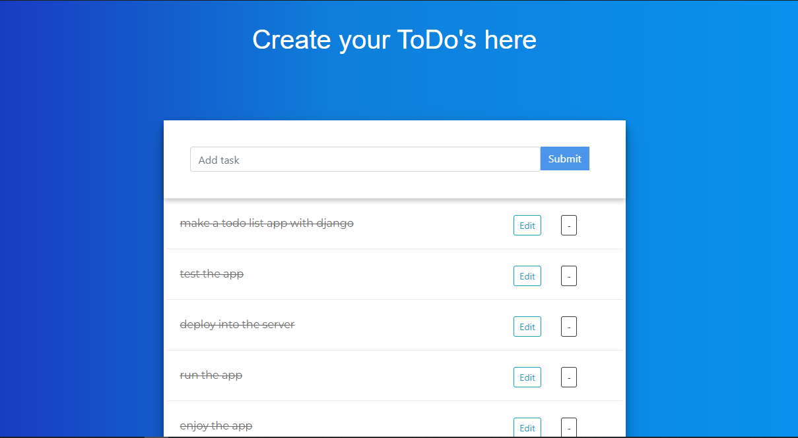
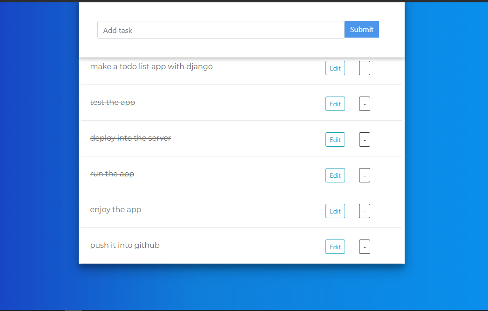

# TodoList
This is a simple todo list app build with Django Framework. The main porpose of this app was to understand REST API and Ajax along with an implemetation.

## Features

- A RESTfull TodoList app
- Add task, edit task, delete task, mark as done/undone

## Screenshots

    
    

### Tools

- **[Django Framework 3.1](https://www.djangoproject.com/)**
- **[Python 3.8.5](https://www.python.org/)** 
- **[Vanilla JS](http://vanilla-js.com/)** 
- **[HTML5](https://html.com/)**
- **[BOOTSTRAP-4.4](https://getbootstrap.com/)**

### Link -> https://restingtodolist.herokuapp.com/

### API overview -> https://restingtodolist.herokuapp.com/api/
